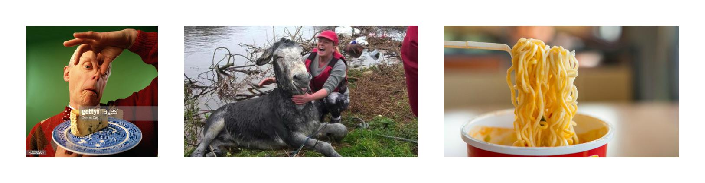
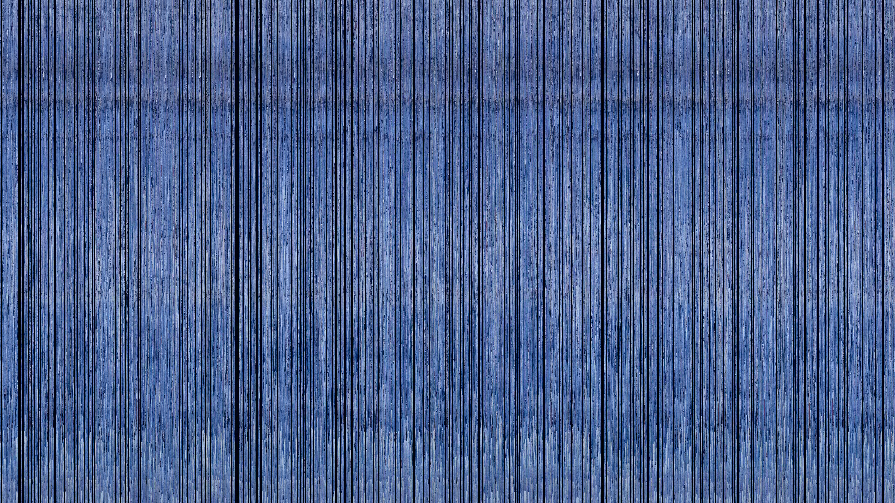

# Chops
Just some quick little scripts I spin up when I need a warmup or want to do some fun coding.

## triptych
Randomly search Google Image Search for three results and build a triptych. Can also be fed search terms.

_chicken bones, lumberjack, light up dance floor_

_dough, manky, noodles_

## slices
Slice an image into vertical bands and randomly reassemble. 

